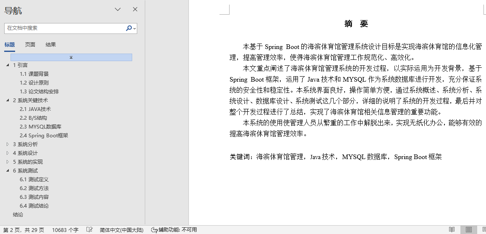
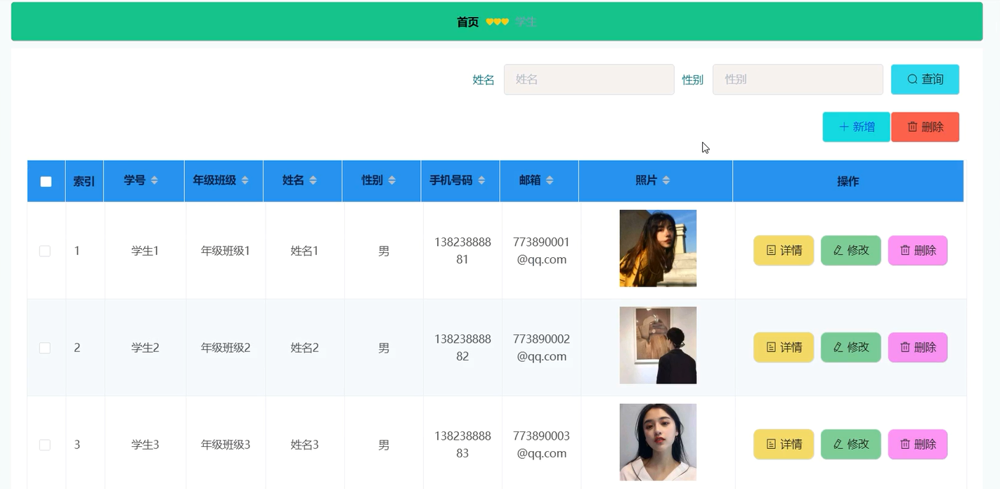
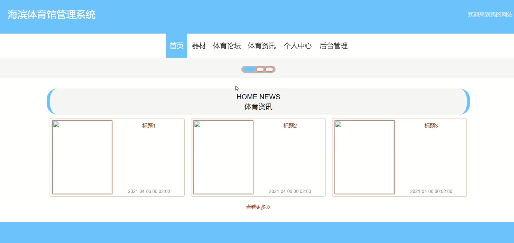
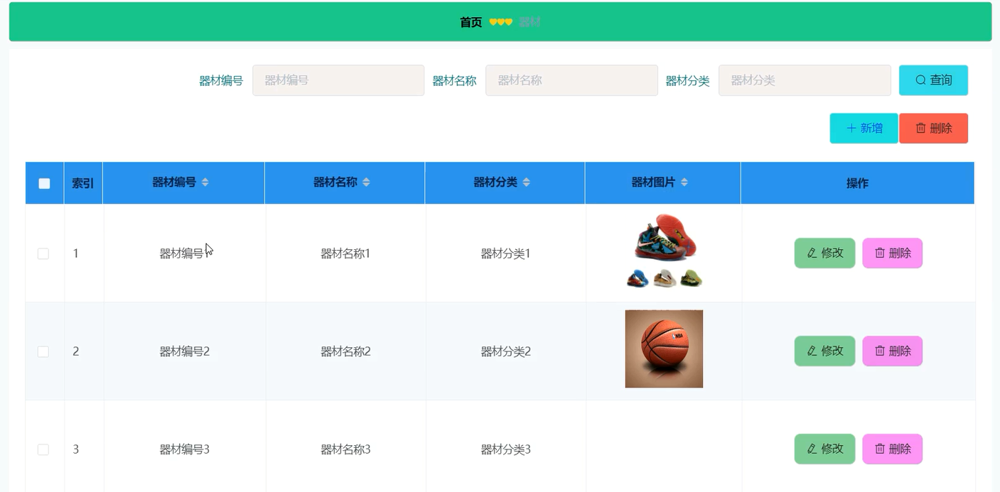
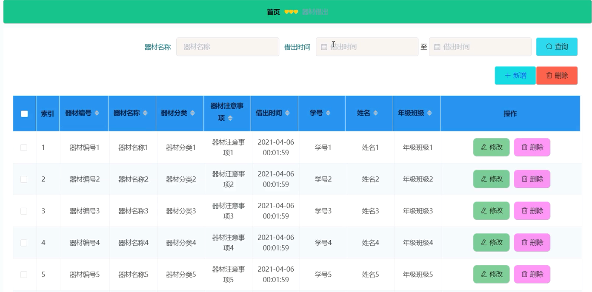
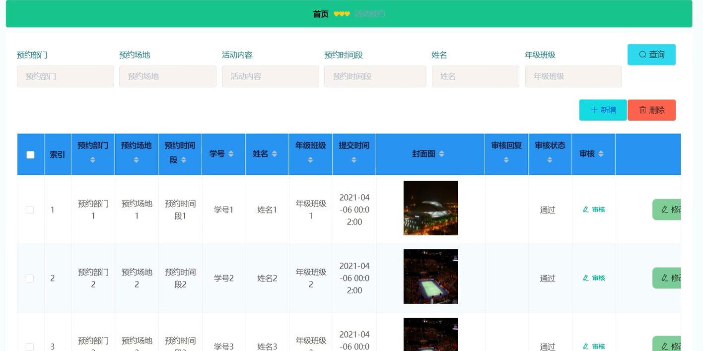

## 基于SpringBoot的海滨体育馆管理系统(程序+报告)

###  获取sql数据库文件: 从戎源码网 (https://armycodes.com/) QQ: 386869957 QQ群: 377586148
###  所有系统地址: (https://github.com/YuLin-Coder/AllProjectCatalog) 
###  所有项目以及源代码本人均调试运行无问题 可支持远程安装部署调试、定制修改、代码讲解

## 项目介绍
基于SpringBoot的海滨体育馆管理系统，系统包含两种角色：用户、管理员，系统分为前台和后台两大模块，主要功能如下：

登录模块的实现
管理员和学生在登录界面输入用户名、密码，并选择用户类型进行登录操作。

注册模块的实现
没有账号的学生用户可进行注册操作。

学生管理模块的实现
管理员可以添加、修改和删除学生信息。

系统主界面模块的实现
学生可以进入系统前台查看系统信息，包括首页、器材信息以及体育论坛等。

器材管理模块的实现
管理员可以添加、修改和删除器材信息，学生可查看器材信息。

器材借出管理模块的实现
学生可以添加器材借出信息，管理员可以查看和管理所有器材借出信息，并可进行修改和删除操作。

活动预约管理模块的实现
学生可以添加活动预约信息，管理员可以查看活动预约信息，并可进行审核、修改和删除操作。

## 项目技术
- 编程语言：Java
- 数据库：MySQL
- 项目管理工具：Maven
- 前端技术：HTML、CSS、JavaScript、Jquery、Vue
- 后端技术：Spring、SpringMVC、MyBatis

## 运行环境
- JDK版本：JDK1.8及以上
- 开发工具：IDEA、Ecplise、Myecplise都可以
- 数据库: MySQL5.7及以上
- Maven：maven3.0及以上
- Node：14.14.0及以上

## 运行截图

